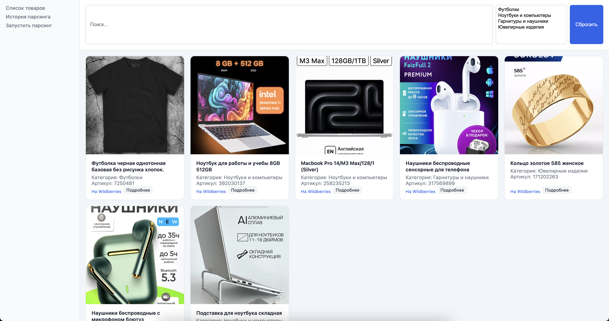
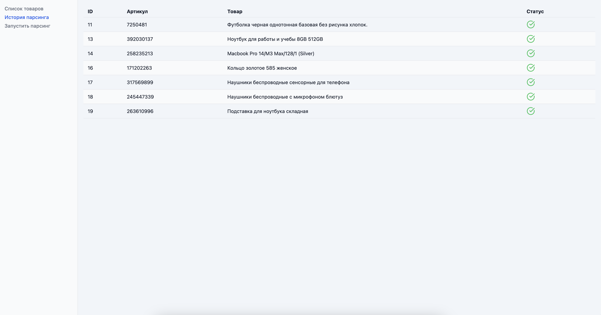
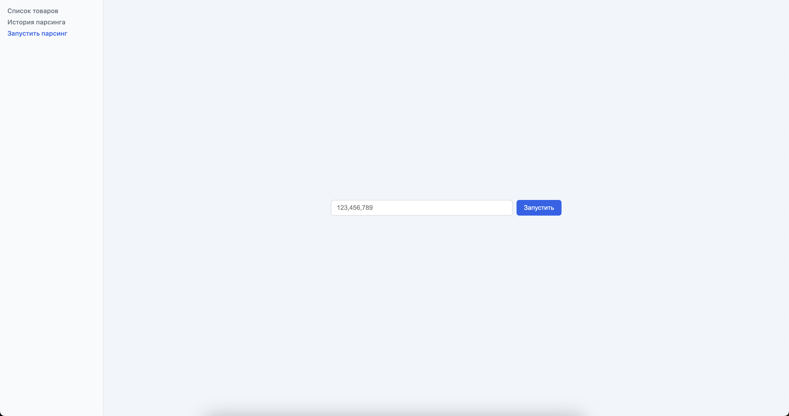

# Краткая пользовательская документация

## Содержание

* [Описание проекта](#описание-проекта)
* [Установка и запуск](#установка-и-запуск)
* [Структура приложения](#структура-приложения)
* [Страницы и функционал](#страницы-и-функционал)

  * [Список товаров](#список-товаров)
  * [Фильтры и поиск](#фильтры-и-поиск)
  * [Карточка товара](#карточка-товара)
  * [История парсинга](#история-парсинга)
  * [Запуск парсинга](#запуск-парсинга)

---

## Описание проекта

Это веб-приложение на React, представляющее собой дешборд для мониторинга и управления сервисом парсинга товаров.

**Бэкенд**: Django + Django REST Framework

**Фронтенд**: React (чистый CSS)

Цель: удобный интерфейс для менеджеров и разработчиков.

---

## Установка и запуск

### Предварительные условия

* Node.js ≥ 18.x
* npm / pnpm / yarn
* Django-бэкенд ([http://127.0.0.1:8000](http://127.0.0.1:8000))

### Шаги установки

```bash
git clone <адрес-репозитория> 
cd wb_list_parser_front
npm install
# или pnpm install / yarn install
npm run dev
# или pnpm run dev / yarn dev
```

Проверьте `API_BASE` в файлах страниц (`src/pages/*.jsx`).

Откройте: [http://localhost:3000](http://localhost:3000)

**Фото 1:** Скриншот стартовой страницы (дешборд после запуска).

---

## Структура приложения

```
src/
├── components/
│   ├── Sidebar.jsx/css
│   ├── ProductCard.jsx/css
│   ├── ProductsToolbar.jsx/css
├── pages/
│   ├── ProductsPage.jsx/css
│   ├── ProductDetailPage.jsx/css
│   ├── HistoryPage.jsx/css
│   ├── ParsePage.jsx/css
├── App.jsx
├── index.css
└── main.jsx
```

---

## Страницы и функционал

### Список товаров

* **Путь**: `/` или `/products`
* **Компонент**: `ProductsPage.jsx`

Отображает грид карточек товаров.

**Фото 2:** Скриншот страницы «Список товаров» с гридом карточек.

### Фильтры и поиск

* **Компонент**: `ProductsToolbar.jsx`
* Поиск и фильтрация категорий с дебаунсом 400 мс.

**Скриншот фильтров с поиском и мультиселектом категорий:** 

### Карточка товара

* **Путь**: `/products/:id`
* **Компонент**: `ProductDetailPage.jsx`

Показывает детальную информацию о товаре.

**Фото 4:** Скриншот карточки товара с галереей фото и таблицей параметров.

### История парсинга

* **Путь**: `/history`
* **Компонент**: `HistoryPage.jsx`

Отображает таблицу с историей статусов парсинга.

**Фото 5:** Скриншот страницы с историей парсинга.

### Запуск парсинга

* **Путь**: `/parse`
* **Компонент**: `ParsePage.jsx`

Форма для ввода артикулов и запуска парсинга.

**Фото 6:** Скриншот страницы формы запуска парсинга (до и после ввода).

---

## Переменные окружения и настройки

По умолчанию используется:

```javascript
const API_BASE = "http://127.0.0.1:8000/api/v1/parser";
```
